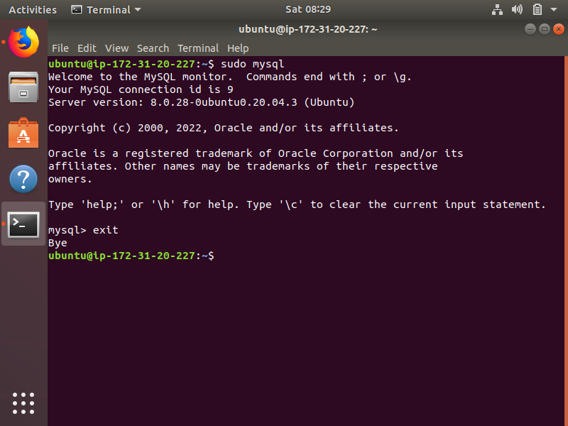

<h2> Project 2: LEMP (Linux Nginx MySQL PHP) Stack Implementation </h2>

<h4> Step 1: Installing the Nginx Web Server </h4>

Commands

* sudo apt install nginx
* sudo systemctl status nginx

  

* http://34.207.112.87:80 

  
  
<h4> Step 2: Installing MySQL </h4>

Commands

* sudo apt install mysql-server
* sudo mysql_secure_installation
* sudo mysql
* mysql> exit

  
  
<h4> Step 3: Installing PHP </h4>

Commands

* sudo apt install php-fpm php-mysql

  
  
<h4> Configuring Nginx to Use PHP Processor </h4>

Commands

* sudo mkdir /var/www/projectLEMP
* sudo chown -R $USER:$USER /var/www/projectLEMP
* sudo nano /etc/nginx/sites-available/projectLEMP
 
      #/etc/nginx/sites-available/projectLEMP

      server {
          listen 80;
          server_name projectLEMP www.projectLEMP;
          root /var/www/projectLEMP;

        index index.html index.htm index.php;

        location / {
            try_files $uri $uri/ =404;
        }

        location ~ \.php$ {
            include snippets/fastcgi-php.conf;
            fastcgi_pass unix:/var/run/php/php7.4-fpm.sock;
         }

        location ~ /\.ht {
            deny all;
        }

      }

* sudo ln -s /etc/nginx/sites-available/projectLEMP /etc/nginx/sites-enabled/
* sudo nginx -t
* sudo unlink /etc/nginx/sites-enabled/default
* sudo systemctl reload nginx
* sudo echo 'Hello LEMP from hostname' $(curl -s http://169.254.169.254/latest/meta-data/public-hostname) 'with public IP' $(curl -s http://169.254.169.254/latest/meta-data/public-ipv4) > /var/www/projectLEMP/index.html
* http://34.207.112.87:80

  
  
<h4> Step 5: Testing PHP with Nginx </h4>

Commands

* sudo nano /var/www/projectLEMP/info.php
* `<?php
  
  phpinfo();`
* http://ec2-34-207-112-87-compute-1.amazonaws.com/info.php

  

* sudo rm /var/www/your_domain/info.php

<h4> Step 6: Retrieving data from MySQL database with PHP </h4>

Commands

* sudo mysql
* mysql> CREATE DATABASE 'example_database';
* mysql>  CREATE USER 'example_user'@'%' IDENTIFIED WITH mysql_native_password BY 'password';
* mysql> GRANT ALL ON example_database.* TO 'example_user'@'%';
* mysql> exit
* mysql -u example_user -p
* mysql> SHOW DATABASES;
* CREATE TABLE example_database.todo_list (item_id INT AUTO_INCREMENT, content VARCHAR(255), PRIMARY KEY(item_id));
* mysql> INSERT INTO example_database.todo_list (content) VALUES ("My first important item");
* mysql>  SELECT * FROM example_database.todo_list;
* mysql> exit
* nano /var/www/projectLEMP/todo_list.php

      <?php
        $user = "example_user";
        $password = "password";
        $database = "example_database";
        $table = "todo_list";

        try {
          $db = new PDO("mysql:host=localhost;dbname=$database", $user, $password);
          echo "<h2>TODO</h2><ol>";
          foreach($db->query("SELECT content FROM $table") as $row) {
            echo "<li>" . $row['content'] . "</li>";
          }
          echo "</ol>";
        } catch (PDOException $e) {
            print "Error!: " . $e->getMessage() . " ";
            die();
        }
* http://ec2-34-207-112-87-compute-1.amazonaws.com/todo_list.php

  
