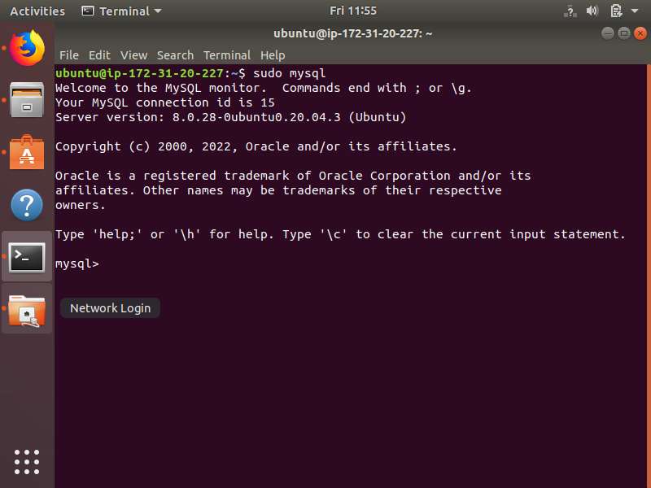
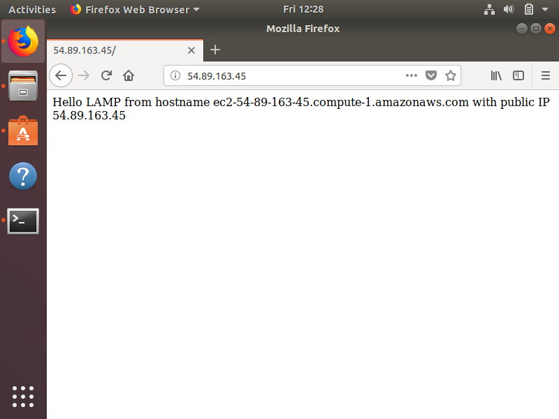

<h2> Project 1: LAMP (Linux Apache2 MySQL PHP) Stack Implementation </h2>

<h4> Step 1: Installing Apache and Updating the Firewall </h4>

EC2 Instance Connection

Commands

<ul>   
  
  <li> sudo apt update  
  <li> sudo apt install apache2 </li> 
   
    
  <li> sudo systemctl status apache2 </li>  
    
  <li> curl http://localhost:80 </li>  
    
  <li> curl -s http://169.254.169.254/latest/meta-data/public-ipv4 </li>  
    
  
</ul>

<h4> Step 2: Installing MySQL </h4>

Commands

<ul>
  
  <li> sudo apt install mysql-server </li>
  <li> sudo mysql_secure_installation </li>  
    
  <li> sudo mysql </li>  
   
  
</ul>

<h4> Step 3: Installing PHP </h4>

Commands

<ul>

  <li> sudo apt install php libapache2-mod-php php-mysql </li>
  <li> php -v </li>  
  
  
</ul>

<h4> Step 4: Creating a Virtual Host for Apache to Serve a Website </h4>

Commands

<ul>
  
  <li> sudo mkdir /var/www/projectlamp </li>
  <li> sudo chown -R $USER:$USER /var/www/projectlamp </li>
  <li> sudo vi /etc/apache2/sites-available/projectlamp.conf </li>
  <li> sudo ls /etc/apache2/sites-available </li>
  <li> sudo a2ensite projectlamp </li>
  <li> sudo a2dissite 000-default </li>
  <li> sudo apache2ctl configtest </li>
  <li> sudo systemctl reload apache2 </li>
  <li> sudo echo 'Hello LAMP from hostname' $(curl -s http://169.254.169.254/latest/meta-data/public-hostname) 'with public IP' $(curl -s http://169.254.169.254/latest/meta-data/public-ipv4) > /var/www/projectlamp/index.html </li>  
  
  
</ul>

<h4> Step 5: Enabling PHP on the Website </h4>

Commands

<ul>
    
  <li> sudo vim /etc/apache2/mods-enabled/dir.conf </li>
  <li> sudo systemctl reload apache2 </li>
  <li> vim /var/www/projectlamp/index.php </li>
  <li> &lt?php  
phpinfo(); </li>  
  
  
</ul>

