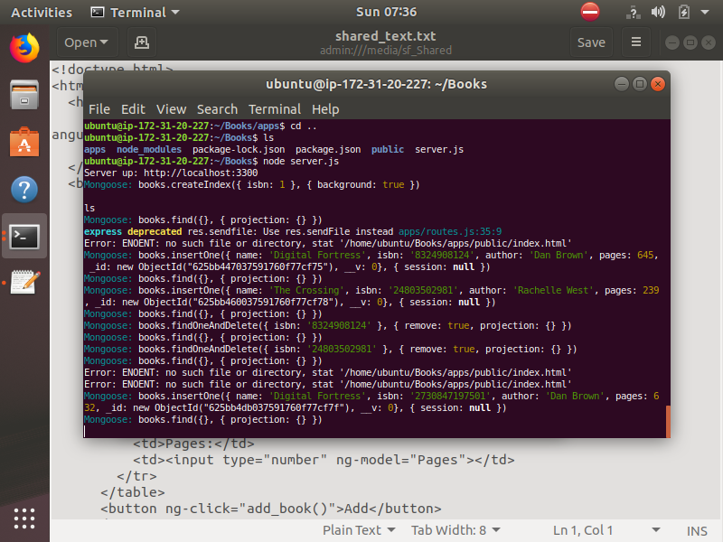

<h2> Project 4: MEAN (MongoDB Express Angular NodeJS) 
  Stack Implementation </h2>

<h4> Step 1: Install Node JS </h4>

Commands 

* sudo apt update
* sudo apt upgrade
* sudo apt -y install curl dirmngr apt-transport-https lsb-release ca-certificates
* curl -sL https://deb.nodesource.com/setup_12.x | sudo -E bash -
* sudo apt install -y nodejs

  
  
 <h4> Step 2: Install MongoDB </h4>
 
 * sudo apt-key adv --keyserver hkp://keyserver.ubuntu.com:80 --recv 0C49F3730359A14518585931BC711F9BA15703C6
 * echo "deb [ arch=amd64 ] https://repo.mongodb.org/apt/ubuntu trusty/mongodb-org/3.4 multiverse" | sudo tee /etc/apt/sources.list.d/mongodb-org-3.4.list
 * sudo apt install -y mongodb
 * sudo apt install -y mongodb
 * sudo systemctl status mongodb

    

 * sudo apt install -y npm
 * sudo npm install body-parser
 * mkdir Books && cd Books
 * npm init
 * vi server.js
 
        var express = require('express');
        var bodyParser = require('body-parser');
        var app = express();
        app.use(express.static(__dirname + '/public'));
        app.use(bodyParser.json());
        require('./apps/routes')(app);
        app.set('port', 3300);
        app.listen(app.get('port'), function() {
            console.log('Server up: http://localhost:' + app.get('port'));
        });
        
     
     
 <h4> Step 3: Install Expresss and setup routes to the server </h4>
 
 * sudo npm install express mongoose
 * mkdir apps && cd apps
 * vi routes.js
 * mkdir models && cd models
 * vi book.js
 * cd ../..
 * mkdir public && cd public
 * vi script.js
 * vi index.html

        <!doctype html>
          <html ng-app="myApp" ng-controller="myCtrl">
            <head>
              
              
            </head>
            <body>
              

                <table>
                  <tr>
                    <td>Name:</td>
                    <td><input type="text" ng-model="Name"></td>
                  </tr>
                  <tr>
                    <td>Isbn:</td>
                    <td><input type="text" ng-model="Isbn"></td>
                  </tr>
                  <tr>
                    <td>Author:</td>
                    <td><input type="text" ng-model="Author"></td>
                  </tr>
                  <tr>
                    <td>Pages:</td>
                    <td><input type="number" ng-model="Pages"></td>
                  </tr>
                </table>
                <button ng-click="add_book()">Add</button>
              

              

              

                <table>
                  <tr>
                    <th>Name</th>
                    <th>Isbn</th>
                    <th>Author</th>
                    <th>Pages</th>

                  </tr>
                  <tr ng-repeat="book in books">
                    <td>{{book.name}}</td>
                    <td>{{book.isbn}}</td>
                        <td>{{book.author}}</td>
                        <td>{{book.pages}}</td>

                        <td><input type="button" value="Delete" data-ng-click="del_book(book)"></td>
                      </tr>
                    </table>
                  

                </body>
              </html>
* cd ..
* node server.js

    

* curl -s http://localhost:3300

    
 
